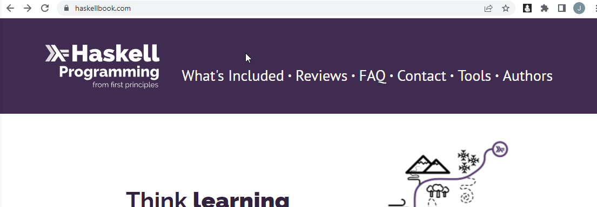

### About
Primarily this is a basic Chrome extension interface that accepts a tag and body along with relevant tabs.

### Demo

### Background
I spend most of my time in front of a computer, particularly within reach/in Chrome. So I want to make a note taking Chrome extension app. This helps me jot down notes and close that tab, not really a RAM concern just wanting to keep track of anything I found interesting at the time.

I have made a couple but they're not really full fledged (no data store/requests). They're usually some kind of injector or they grab all the tabs I have so I can quickly save it in a notepad with a date. My intent is to track all the random things I'm thinking about. At a glance I can see my previous history of what I was looking into (these would be tagged topics). And I will have that "grab all tabs" feature as well and include it here.

I am still working on a centralized personal data store since I have other note taking methods that are using their own data stores.

### How it works
`logic.js` is the JS running for the popup UI, the API calls are done on the background page side `background.js`. The API is a local one no auth/assumed to be secure.

### Disclaimer
Use at your own risk. I am not a security expert/primarily just intend to use this for personal note taking about random topics I want to learn about. `background.js` is supposedly [as secure as what Chrome password manager uses](https://stackoverflow.com/questions/17287553/chrome-extension-storing-variables-in-background-page-is-secure/17293075#17293075).