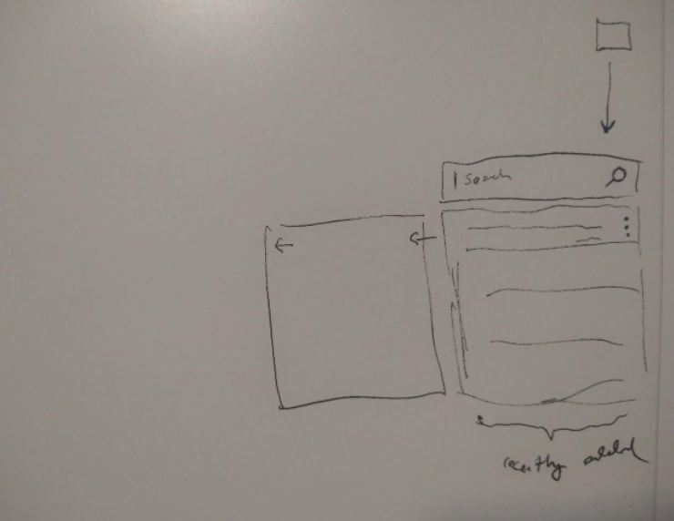

# refer
https://developer.chrome.com/docs/extensions/mv3/user_interface/

05/09/2022
Alright back on this... kind of a half-burnt day didn't sleep too much

12:58 PM
Ahh man... I'm not feeling it

Your boy's gotta start grinding that leet and DSA

I've never really been a strong algo person.

If nothing changes in a month or two I'll be looking for a new job.

I'll work on getting display done, there's nothing to figure out it's just wiring but I'm spent today.

1:19 PM
Added note viewing

2:41 PM
Little distracted but I think I can add onmodify save

2:52 PM
Oof I forgot how I made this API a "new-row everytime" type... it's cool for versioning, don't have to search/update... but also why... you have an id, can update by id... this just means the database is massive, like a thousand char entry, modify it by 1 character results in 999 or 1001 new characters... damn

3:30 PM
Think I'll just go ahead and add the note creation too while I'm at it, just added update

hmm... I think I'll be a good boy and add a contextual wrapper around window.postMessage that'll make it easier to understand what it's doing

3:48 PM
Cool only thing I'm missing now is delete which I rarely use, the API method exists but yeah

3:55 PM
well this is at a usable state now, so I'll use it for now

4:46 PM
Ooh... Dunce boy just thought of something, is `window.postMessage` secure?

Let me test it out...

Yeap... it's accessible by the website damn...

Great write up [here](https://owasp.org/www-chapter-london/assets/slides/OWASPLondon_PostMessage_Security_in_Chrome_Extensions.pdf)

Some info [here](https://stackoverflow.com/questions/28024563/how-to-do-secure-communication-from-any-web-page-to-a-chrome-extension)

05/08/2022
Finally have some time to work on this. I really want this because all this time I've just been saving tabs but never looking at them again.

Also I have tabs I don't want to close because I want to write down that info somewhere.

4:52 PM
let's see if I can build this in two hours, the basic functionality is pretty simple.

I already have the API I'll use so I just have to post to that, hope I don't run into any problems.

I remember you have to deal with permissions/background JS, things like that for Chrome Extensions but it is possible.

Main hurdle is getting the API to work and it's a non-https local one.

At this time I have imported the unpacked chrome extension and I still have to build the UI/get it to show up.

GD it stop looking at memes

It puts the headphones on to focus or it gets the hose again

5:29 PM
Dang... already some problems, can't make the extension as I envisioned due to constraints (maximum size), that's alright.

Yeah there's some [tricks](https://stackoverflow.com/questions/66927030/is-there-a-way-to-change-the-position-location-of-a-chrome-extension-popup) around it but yeah.

Anyway need to make progress, this is not the main thing I want to work on today.

5:46 PM
I'm stuck, can't do this request, when the code is in there it breaks the page somehow with an "unexpected token" message starting at the `use strict;` line

5:53 PM
Seems to be some promise issue with fetch

6:02 PM
Damn I'm still failing

Dayum look at this [answer](https://stackoverflow.com/questions/9515704/use-a-content-script-to-access-the-page-context-variables-and-functions) lol "table of contents" haha that's legit

I have injected code before... sucks to go that route but why not. I'm interested in getting it done, this is a tool for me. I have injected code before eg. the YT hide tiles on load [work](https://github.com/jdc-cunningham/chrome-extension-code-injector) I did.

So I think I'll do something like the action tries to inject this code, if it's injected already just toggle it.

Yeah... I was trying to migrate to V3 like a good boy, but nah I want to get this done. This is a CRUD app I could crap out in 10 minutes but I'm stuck trying to figure out how to work around CE's security stuff which I'm not against, I just don't have the time/care to get into it right now.

6:31 PM
Okay I think I got it.

The mechanism will be:
- chrome extension icon will be clicked to show/hide the UI
- the UI is injected at the start
- the show/hide command is using `window.postMessage`

Unfortunately in 20 minutes I gotta stop/completely mind shift. Really want to make progress on the robot too but really want to prototype this. I'll do a max cap of another hour or two later on to get this to a working state.

Goal for TLR is plotting boxes in ThreeJS as the robot hits them.

Yeah dang will have to return to this in a bit.

10:33 PM
Alright back at it, I'm already feeling spent crap, I did just eat so maybe I gotta wait a little bit

procrastinating? omg literally me... also some police cars outside my apt man... keep thinking bullet gonna come outta nowhere and hit me.

Alright let's get that bread (there's no bread this is free)

Also my micro crypto trader is at 26% loss nice STONKS.

Ugh my fingers are oily damn it, anyway the postMessaging works pretty cool

Actually it's not, also the event fires from browserAction increment/keep increasing by 1 interesting

No it's fine I was just rebinding every time.

Still the two-way comms is not working as I thought it's posting to itself.

Okay so I'm not using postMessage I'm using chrome.runtime.onMessage for the injected to browser action (chrome extension icon) which I don't really need, I need the other one which is the chrome tabs.

[reference](https://stackoverflow.com/questions/25756807/calling-content-script-function-on-chrome-browseraction-onclicked)

[reference](https://stackoverflow.com/questions/14245334/sendmessage-from-extension-background-or-popup-to-content-script-doesnt-work)

Also it's not the injected code logic that's getting the ping from the chrome extension icon it's the loader (content script).

So I'll have to bridge that too.

Lol as they put "do not cross" tape lines across my parking lot, nice.

11:40 PM
Alright I'm done watching

I'm still trying to wrap my head around how to architect this thing based on what I have to work with.

12:55 AM
Finally got this [error](https://stackoverflow.com/questions/54126343/how-to-fix-unchecked-runtime-lasterror-the-message-port-closed-before-a-respon) to go away "...port closed before...".

So I've got everything working, also had this thought of a background job that pings the icon with a notification.

future work though

1:04 AM
Wow this is great, it's working, next thing is adding the post request mechanism

1:15 AM
Hmm this might have been dumb/obvious, but I can't call APIs from inside the injected DOM on random websites... so it looks like I'll have to start the API call from the injected dom by talking to the `background.js` script and then send the data back.

1:22 AM
Yeap... mixed https/http now hmm

Omg I got it okay... so the request has to be done in background.js

So now I gotta figure out how to talk to background.js from the injected dom... hmm

1:26 AM
Okay the basics are working now... need to summarize this

1:43 AM
Making good progress this took me longer than I anticipated

2:07 AM
This is kind of funny, I made this [API](https://github.com/jdc-cunningham/cross-platform-app/blob/master/shared-api/api/methods/notes.js) a while back and I have to remember how it works.

I have been using it almost everyday with the cross platform desktop app. The other tool I made that I use almost on a daily basis for the last 4 years or so is the Twilio SMS app that I use to remind myself of stuff in the future.

And Postman is great to test the API that's running already

This is another tool I imagine I will use a lot to track things.

I seem to have broken something during my refactoring

Ooh nice song
Masques III Midnight Oasis

2:32 AM
Omg yes finally... running into dumb problems like it's a JSON text or wrong key being accessed... but it works. I have done an API query from an injected DOM and renderd it over the website I'm on.

2:38 AM
So now I'll just build out the rest of the CRUD functionality mostly front end work since the API already exists.

Ooh... I already have the chrome query all tabs... so I'll definitely add that for the "save tabs" feature.

For now I'll just do the CRUD functionality of reading/writing notes.

2:51 AM
I'm losing steam... I made good progress though now it's just work... trivial stuff

For example I will partially watch some YT video but not finish it, then I close all tabs in Chrome to start with a fresh slate. I could capture those YT links and put them on a watch queue to pick up later if I'm looking for something to watch.